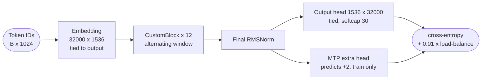
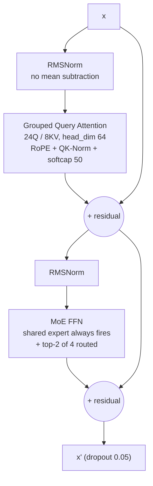
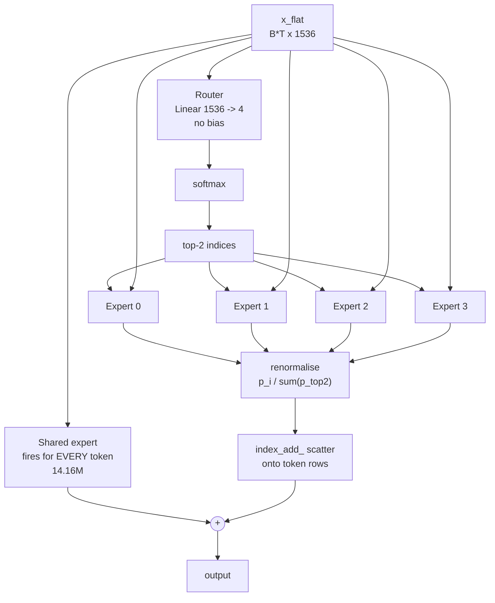
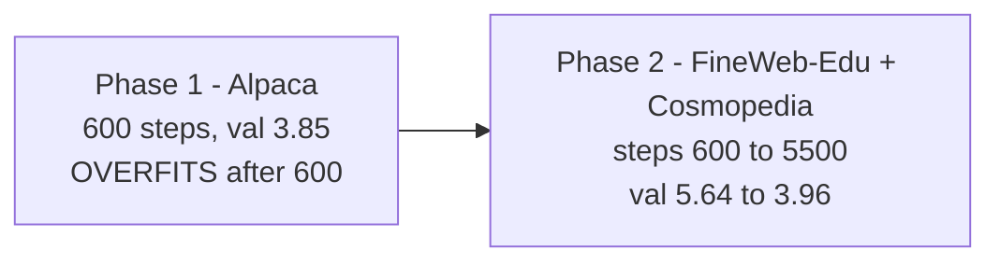

<div align="center">

# Kochi-LLM

### A 1.02B-parameter Mixture-of-Experts language model trained entirely from scratch

**including its own BPE tokenizer, data pipeline, and distributed training setup**

[](https://github.com/Dadhichi-Sarker-Shayon/KochiLLM-v1.0)
[](https://github.com/Dadhichi-Sarker-Shayon/KochiLLM-v1.0)
[](https://github.com/Dadhichi-Sarker-Shayon/KochiLLM-v1.0)
[](https://github.com/Dadhichi-Sarker-Shayon/KochiLLM-v1.0)
[](https://github.com/Dadhichi-Sarker-Shayon/KochiLLM-v1.0)

[](https://huggingface.co/ShayonSarker/KochiLLM-v1.0)
[](https://huggingface.co/ShayonSarker/KochiLLM-v1.0)
[](https://huggingface.co/ShayonSarker/KochiLLM-v1.0)
[](https://huggingface.co/ShayonSarker/KochiLLM-v1.0)

[](https://github.com/Dadhichi-Sarker-Shayon/KochiLLM-v1.0)
[](https://github.com/Dadhichi-Sarker-Shayon/KochiLLM-v1.0)
[](https://github.com/Dadhichi-Sarker-Shayon/KochiLLM-v1.0)
[](https://huggingface.co/datasets/HuggingFaceTB/smollm-corpus)

[](https://www.python.org)
[-ee4c2c?style=flat-square&logo=pytorch&logoColor=white)](https://pytorch.org)
[](LICENSE)

[](https://huggingface.co/ShayonSarker/KochiLLM-v1.0)
[](https://github.com/Dadhichi-Sarker-Shayon/KochiLLM-v1.0)

</div>

---

## At a glance

| | |
|---|---|
| Total parameters | **1,023.26M** |
| Active parameters per token | **634.26M** (1 shared + top-2 of 4 routed experts) |
| Layers / model dim | 12 / 1536 |
| Attention | 24 query heads / 8 KV heads (GQA ratio 3), head_dim 64 |
| Experts | 4 routed (top-2) + 1 shared — DeepSeek-MoE style |
| Attention windows | alternating: full on even layers, 512-token sliding on odd |
| Context length | 1024 tokens |
| Tokenizer | custom BPE, 32,000 vocab, regex pre-tokenization |
| Corpus | FineWeb-Edu + Cosmopedia-v2, 4:1 mix |
| Training tokens | **180,224,000** (0.9996 epochs, 0.176 tokens/param) |
| Global batch | 32,768 tokens (2 ranks × 16 grad-accum × 1 micro × 1024 ctx) |
| Validation loss | **3.96** final (annealed) · 3.91 best · 5.64 at Phase-2 start |
| Hardware | 2× Tesla T4 (15 GB), FSDP FULL_SHARD, fp16 + GradScaler |
| Throughput | ~37.9 s/step · ~865 tokens/s |
| Compute cost | ~52 GPU-hours |

---

## Table of contents

- [Repository layout](#repository-layout)
- [Architecture](#architecture)
  - [Forward pass](#forward-pass-overview)
  - [Parameter budget](#parameter-budget)
  - [Component deep dive](#component-deep-dive)
  - [MoE routing](#moe-routing-in-detail)
  - [Compute characteristics](#compute-characteristics)
- [Tokenizer](#tokenizer)
- [Data pipeline](#data-pipeline)
- [Training](#training)
  - [Phase 1 — Alpaca warmup](#phase-1--alpaca-warmup)
  - [Phase 2 — continued pre-training](#phase-2--continued-pre-training)
  - [Fitting 1B parameters on two 15 GB GPUs](#fitting-1b-parameters-on-two-15-gb-gpus)
  - [Checkpointing and resume protocol](#checkpointing-and-resume-protocol)
- [Results](#results)
- [Sample output](#sample-output)
- [Engineering lessons](#engineering-lessons-learned-the-hard-way)
- [Publishing to Hugging Face](#publishing-to-hugging-face)
- [Reproducing](#reproducing)
- [Limitations](#limitations)
- [License](#license)

---

## Repository layout

Every tracked file, and what it is for.

### Core library

| File | Lines | Purpose |
|---|---:|---|
| [`architecture.py`](architecture.py) | 322 | **The model.** `MyCustomLLM` plus every building block: `CustomRMSNorm`, `CustomSwiGLU`, `MoELayer`, `precompute_freqs_cis`, `apply_rotary_emb`, `CustomGroupedQueryAttention`, `CustomBlock`. No config file — `MyCustomLLM(**config)` is driven by the dict saved in each checkpoint. |
| [`tokenizer.py`](tokenizer.py) | 118 | **Custom BPE.** `MyCustomTokenizer` with `train` / `encode` / `decode` / `save` / `load`. Regex pre-tokenization, byte-level base vocab, frequency-based merge loop. Produces `custom_bpe_tokenizer.pkl`. |
| [`data_loader.py`](data_loader.py) | 34 | **Batching.** `CustomDataLoader` memory-maps `train.bin` / `val.bin` as `uint16`, slices random `[B, 1024]` windows, and shifts by one for next-token targets. |
| [`prepare_data.py`](prepare_data.py) | 63 | **Phase-1 data.** Downloads Alpaca, formats it into chat transcripts, trains the 32k tokenizer on a 5 MB sample, and writes tokenized `.bin` shards. |
| [`generate.py`](generate.py) | 80 | **Inference.** `generate()` implements KV-cache sampling with temperature and top-k, plus a `main()` CLI (`--prompt`, `--tokens`, `--temperature`, `--top_k`, `--checkpoint`). |
| [`train_custom.py`](train_custom.py) | 272 | **Training loop.** FSDP setup, cosine schedule with warmup, gradient accumulation, `no_sync()` optimisation, rank-0-decides-then-broadcast checkpointing, and the 10-hour time cap. This is the source of truth for the recipe. |

### Notebooks

| File | Purpose |
|---|---|
| [`notebooks/01_phase1_alpaca.ipynb`](notebooks/01_phase1_alpaca.ipynb) | Phase 1. Trains on Alpaca; best checkpoint lands at step 600. |
| [`notebooks/02_phase2_pretrain.ipynb`](notebooks/02_phase2_pretrain.ipynb) | Phase 2. Streams FineWeb-Edu + Cosmopedia-v2, encodes ~200M tokens with the **frozen** tokenizer, then trains. |
| [`notebooks/03_phase2_continue.ipynb`](notebooks/03_phase2_continue.ipynb) | **Self-resuming.** Finds the newest `latest_backup_model.pth`, validates the data shards, seeds from it, and restarts best-tracking. The same notebook covers every subsequent session — run it repeatedly until step 5,500. |
| [`notebooks/04_test.ipynb`](notebooks/04_test.ipynb) | Generation smoke test. Loads the newest checkpoint, verifies the tokenizer round-trips, generates from four prompts. |
| [`notebooks/05_upload_hf.ipynb`](notebooks/05_upload_hf.ipynb) | Publishes the most-trained checkpoint of every attached run to Hugging Face as bf16 safetensors, one folder per run under `runs/`. |

### Project metadata

| File | Purpose |
|---|---|
| [`README.md`](README.md) | This document. |
| [`LICENSE`](LICENSE) | MIT. |
| [`requirements.txt`](requirements.txt) | `torch`, `numpy` at runtime; `datasets`, `huggingface_hub` for notebooks only. |
| [`.gitignore`](.gitignore) | Excludes weights (`.pth`, `.safetensors`), tokenized data (`.bin`, `.pkl`), and `archive/`. |
| [`.gitattributes`](.gitattributes) | Normalizes line endings to LF so Windows clones do not churn diffs. |

### Not in Git, by design

| Path | Why excluded |
|---|---|
| `archive/v0-prototype/` | The **discarded first prototype**: `dim=512`, 8 layers, 8k vocab, ~90M params, trained on Alpaca. Its `best_model.pth` (309 MB), `train.bin`, `val.bin`, and 8k-vocab tokenizer are kept locally only. Publishing them would misrepresent the project. |
| `*.pth`, `*.safetensors` | 4.1 GB each; far past GitHub's 100 MB limit. Published to Hugging Face instead. |
| `train.bin`, `val.bin` | Tokenized corpora, 344 MB + 39 MB. Fully reproducible from the tokenizer + a streaming pass. |
| `custom_bpe_tokenizer.pkl` | 737 KB binary pickle. Regenerated by `prepare_data.py`; also shipped on Hugging Face. |

---

## Architecture

### Forward pass (overview)



### Inside one `CustomBlock`



Layer *i* uses a **512-token sliding window when `i % 2 == 1`**, full attention when `i % 2 == 0`. So layer 0 is
full-attention, which matters for cached decoding (see [KV cache](#kv-cache-and-sliding-window-interaction)).

### Inside `MoELayer`



### Parameter budget

Measured directly off the instantiated model.

| Component | Per layer | x12 |
|---|---:|---:|
| `attn.q_proj` (1536 → 1536) | 2.359M | 28.31M |
| `attn.k_proj` (1536 → 512) | 0.786M | 9.44M |
| `attn.v_proj` (1536 → 512) | 0.786M | 9.44M |
| `attn.o_proj` (1536 → 1536) | 2.359M | 28.31M |
| `attn.q_norm` + `attn.k_norm` (64 each) | 128 | 1,536 |
| `norm1` + `norm2` (1536 each) | 0.003M | 0.037M |
| `ffn.shared_expert` | 14.156M | 169.87M |
| `ffn.experts.0–3` | 56.623M | 679.48M |
| `ffn.router` (1536 → 4) | 0.006M | 0.074M |
| **Per-layer total** | **77.080M** | **924.96M** |

| Global component | Parameters |
|---|---:|
| `embed.weight` (tied to `output.weight`) | 49.152M |
| `extra_heads.0.weight` (MTP, train only) | 49.152M |
| `norm.weight` (final) | 0.002M |
| **Total** | **1,023.262M** |

**FFN is 90.4% of the model.** The MTP head is 4.8% and exists only during training — it is discarded at
inference and costs nothing in generation.

**Active parameters per token: 634.26M**

| | Parameters |
|---|---:|
| 3 experts per layer (shared + 2 routed) x12 | 509.61M |
| Attention x12 | 75.50M |
| Tied output head | 49.15M |
| **Active total** | **634.26M** |

### Component deep dive

#### `CustomRMSNorm`

```python
self.weight * (x * torch.rsqrt(torch.mean(x ** 2, dim=-1, keepdim=True) + eps))   # eps = 1e-6
```

Pure RMS scaling — **no mean subtraction**, unlike LayerNorm. Cheaper and numerically steadier for
pre-training. `weight` is a learned per-dimension gain (1,536 for `norm1`/`norm2`, 64 for QK-Norm).

#### `CustomSwiGLU`

```python
w3(F.silu(w1(x)) * w2(x))     # w1,w2: 1536 -> 3072 ; w3: 3072 -> 1536, all bias-free
```

Gated GELU with a hidden width of `2 x dim = 3072`. Three matmuls, **14.156M parameters** each.
`w3` is tagged `IS_RESIDUAL_PROJECTION` so it gets the smaller `0.02/sqrt(2*n_layers)` init.

#### `CustomGroupedQueryAttention`

- **GQA**: 24 query heads share 8 KV heads (ratio 3). KV projections are `1536 → 512`, cutting KV
  parameters and activation memory by 3× versus MHA.
- **QK-Norm**: `q_norm` and `k_norm` are RMSNorm over `head_dim = 64`, applied *before* RoPE. This is
  the single most effective stabilizer for fp16 training at this scale — it prevents the attention
  logits from blowing up as `n_layers` grows.
- **RoPE**: applied to q and k only. Frequencies are precomputed once as a complex buffer of shape
  `[max_seq_len * 2, head_dim/2]` (2048 positions — headroom past the 1024 training context for
  cached decoding). `theta = 10000`. The implementation promotes to `float32`, multiplies in complex
  space, then casts back to the input dtype.
- **Logit soft-capping**: `att = 50 * tanh(att / 50)` (Gemma-2 style), applied before softmax.
- **Causal mask**: `tril`, and for sliding-window layers also subtracts
  `tril(ones, diagonal=-(window_size+1))`, zeroing anything beyond the window. Registered as a
  persistent buffer, so it round-trips through the checkpoint.
- **Dropout 0.05** on attention weights (`attn_dropout`) and on the output projection (`resid_dropout`).

#### `CustomBlock`

```python
x = x + attn(norm1(x), freqs_cis)
x = x + drop(ffn(norm2(x)))
```

Pre-norm residual block. `ffn` is a `MoELayer`, not a dense FFN — this single substitution is why the
model has 1B parameters at 634M active cost.

#### `MyCustomLLM`

- **Embedding scale**: `x = embed(idx) * sqrt(1536)`, then dropout. Without this the embedding
  activations start an order of magnitude smaller than the residual stream.
- **Weight tying**: `self.embed.weight = self.output.weight` — one tensor, two roles, saving 49.15M
  parameters. (This is why `output.weight` is dropped when serializing to safetensors: the two share
  storage and `safetensors` refuses to write shared tensors twice.)
- **Final logit soft-capping**: `30 * tanh(logits / 30)` on both the main and MTP heads.
- **Multi-token prediction** (`n_predict=2`): one extra linear head predicts token `i+2`. Extra head
  *k* uses targets `targets[:, k-1:]`, i.e. position *i* is trained to predict token *i+k*, with
  out-of-range positions masked to `ignore_index=-1`. The two losses are **averaged**
  (`loss / n_predict`), not summed, so the objective stays on the same scale as a single head. The
  head is discarded at inference — zero generation cost, richer hidden states during training.
- **Weight init**: normal(0, 0.02) everywhere, with the `0.02 / sqrt(2 * 12)` residual-projection
  variant applied to `w3` and `attn.o_proj`.

### MoE routing in detail

```python
router_logits = router(x_flat)              # 1536 -> 4
router_probs  = softmax(router_logits)      # over 4 experts
top_k_probs, top_k_idx = topk(router_probs, 2)
weights       = top_k_probs / top_k_probs.sum()   # renormalise the selected 2 to sum to 1
output        = shared_expert(x_flat) + scatter(weights * experts[top_k_idx])
```

- **Shared expert.** One extra SwiGLU fires on every token unconditionally. It absorbs universal
  patterns (grammar, common n-grams), leaving the router free to specialise. This is the DeepSeek-MoE
  trick and it is far more robust against expert collapse than load-balancing loss alone.
- **Load-balancing loss.** Per layer, with `f` = fraction of (token, slot) pairs routed to each expert
  and `p` = mean router probability:

  ```
  aux_layer = num_experts * sum_i(f_i * p_i) = 4 * sum_i(f_i * p_i)
  loss     += 0.01 * mean_over_12_layers(aux_layer)
  ```

  Minimised (value 1.0) when routing is perfectly uniform. The `0.01` coefficient keeps it small
  relative to the cross-entropy term.
- **Dispatch.** For each expert, tokens assigned to it are gathered with a boolean mask, run through
  that expert, scaled by their gate weight, and scattered back with `index_add_`. One loop over 4
  experts, one batched forward per expert.
  `ponytail:` deliberate ceiling — a grouped GEMM would replace the Python loop and its 48
  per-forward GPU synchronisations (`if mask.any()` forces a device sync) with a single batched matmul.
  It was not worth the correctness risk mid-run; it is the top identified speedup.

### Compute characteristics

| | |
|---|---|
| Active params/token | 634.26M |
| Forward FLOPs/token | ~1.27 GFLOP |
| Train FLOPs/token (fwd + bwd) | ~3.82 GFLOP |
| Observed effective throughput | ~3.3 TFLOP/s across 2× T4 |
| Sequence length | 1024 — keeps the quadratic `O(T²d)` attention term to roughly 6% of total FLOPs |
| Bottleneck | FSDP `FULL_SHARD` re-gathers every layer's weights **16× per optimizer step** (once per micro-batch) over PCIe with no NVLink |

Identified but not applied: `ShardingStrategy.SHARD_GRAD_OP` + 8-bit AdamW removes the parameter
all-gathers entirely and was estimated at 1.4–1.8×. Deferred because switching sharding strategy
mid-run risks the checkpoint lineage that produced this release.

---

## Tokenizer

A from-scratch byte-level BPE. No `tokenizers` library, no `transformers`.

### Pre-tokenization

```python
_PATTERN = r"""'(?:s|t|re|ve|m|ll|d)| ?\w+| ?[^\s\w]+|\s+"""
```

Applied **before** BPE, so merges never cross a word boundary. Without this, BPE happily learns
merges like `"e" + " cat"` and produces non-words. This is the same strategy GPT-2 and GPT-4 use.

### Merge loop

1. Regex-split the training text into chunks; count chunk frequencies.
2. Convert each **unique** chunk to a list of raw byte IDs (base vocab = all 256 byte values).
3. Repeat `32000 - 256 = 31744` times: count adjacent pairs across unique chunks weighted by chunk
   frequency, apply the globally most frequent pair as the next merge ID, rewrite the affected
   chunks.

Because the pair search runs over *unique chunks with frequency weights*, it is dramatically cheaper
than merging over a raw token stream — and produces the same result.

### Apply-time merge

```python
while len(tokens) >= 2:
    mergeable = {p: self.merges[p] for p in set(zip(tokens, tokens[1:])) if p in self.merges}
    if not mergeable: break
    best = min(mergeable, key=mergeable.get)     # lowest merge ID = highest priority
    tokens = self._apply_merge(tokens, best, self.merges[best])
```

Merges are applied in **learned priority order** (lowest ID wins), which is what makes the merge
sequence deterministic and reproducible.

### Files

- `custom_bpe_tokenizer.pkl` — a pickle of `{'merges': {...}, 'vocab': {...}}` (737 KB for 32k vocab).
- Trained on a 5 MB sample of the Phase-1 Alpaca corpus, then **frozen** for all of Phase 2. Freezing
  matters: swapping tokenizers mid-run would invalidate the entire checkpoint and require retraining
  the embedding matrix.

---

## Data pipeline

### Corpus

| | |
|---|---|
| Sources | `HuggingFaceFW/fineweb-edu` and `HuggingFaceTB/smollm-corpus` (config `cosmopedia-v2`) |
| Mix | 4:1 FineWeb-Edu : Cosmopedia-v2 (`i % 5 == 4` picks Cosmopedia) |
| Rationale | FineWeb-Edu for broad web-text structure; Cosmopedia-v2 for textbook-quality prose and academic register |
| Streaming | Yes — `load_dataset(..., streaming=True)`, so nothing is ever fully downloaded |
| Document separator | `\n<|endoftext|>\n` |

### Encoding

```python
ids = tok.encode(buf)                       # 2M-character chunks
assert max(ids) < 65536                     # safety check before narrowing
np.array(ids, dtype=np.uint16).tofile(f)   # packed, no header, no length prefix
```

- Text is buffered into **2,000,000-character chunks** before encoding, so the regex pass and BPE see
  large blocks rather than one document at a time.
- Stored as raw `uint16`. Final train split: **180,295,081** tokens; val: **20,109,016**.
- `train.bin` is 344 MB, `val.bin` is 39 MB. A 20M-token val split holds ~19,600 disjoint 1024-token
  windows, so the 10-batch evaluation sample is small — see [Limitations](#limitations).

### Batching

```python
self.data = np.memmap(bin_file, dtype=np.uint16, mode='r')
ix  = torch.randint(len(self.data) - self.block_size, (batch_size,))
x   = stack([data[i : i + 1024] for i in ix])
y   = stack([data[i+1 : i+1025] for i in ix])
```

Memory-mapped, so RAM use is independent of corpus size. Random sampling **with replacement** over a
contiguous token stream. Note the stream is *not* document-aware — the attention mask does not reset
at `<|endoftext|>` boundaries.

---

## Training



### Phase 1 — Alpaca warmup

| | |
|---|---|
| Data | 52K Alpaca instruction examples formatted as chat transcripts |
| Purpose | Get the model off random initialization so Phase 2 starts from something stable |
| Result | Best val **3.85 at step 600**, then val *rose* to 5.8 by step 1400 |
| Verdict | **Overfits.** Kept only as a Phase-2 seed |

This overfitting was informative rather than wasted: it established that 52K instruction pairs is
nowhere near enough signal, and that the model does learn. The checkpoint at step 600 is the Phase-2
starting point.

### Phase 2 — continued pre-training

| | |
|---|---|
| Seed | Phase-1 step-600 checkpoint |
| Data | FineWeb-Edu + Cosmopedia-v2, frozen tokenizer, 180.2M train tokens |
| Steps | 5,500 (0.9996 epochs) |
| Peak LR | 1e-3, cosine decay, 200 warmup steps |
| Min LR | 1e-4, reached exactly at step 5,499 |
| Weight decay | 0.1 |
| Gradient clip | 1.0 |
| Dropout | 0.05 |
| Precision | fp16 + `GradScaler` (T4 is Turing — **no bf16 support**) |
| Global batch | 32,768 tokens |
| Time cap | 10 h per Kaggle session, then checkpoint and exit |

Steps for one epoch: `180,295,081 / 32,768 = 5,503`, so the schedule uses **5,500**.

#### Why the schedule was retargeted

The schedule originally ran to `max_iters = 10000`. On that schedule, stopping at 5,500 would leave
LR at `4.92e-4` — a **half-annealed** model, measurably worse than one taken all the way down.
Changing `max_iters` to 5,500 at step 3,366 makes cosine reach `min_lr` exactly at the end, at the
cost of an abrupt LR step from `8.0e-4` to `4.14e-4` on resume. That step is harmless here because
AdamW moments reset at every session boundary anyway.

### Fitting 1B parameters on two 15 GB GPUs

This is the whole reason FSDP is in the project.

| | |
|---|---|
| fp32 parameters | 4.09 GB |
| fp32 gradients | 4.09 GB |
| AdamW moments (2 × fp32) | 8.19 GB |
| **Total optimizer-resident** | **~16.4 GB** |
| Available per T4 | ~15 GB |

A 1B model plus AdamW **does not fit on one T4**, and DDP replicates everything on both GPUs. FSDP
`FULL_SHARD` shards parameters, gradients, and optimizer state across ranks, leaving ~2 GB per GPU
for activations.

```python
auto_wrap_policy = functools.partial(transformer_auto_wrap_policy,
                                      transformer_layer_cls={CustomBlock})
mp_policy = MixedPrecision(param_dtype=fp16, reduce_dtype=fp16, buffer_dtype=fp16)
model = FSDP(model, auto_wrap_policy=auto_wrap_policy, mixed_precision=mp_policy,
             sharding_strategy=ShardingStrategy.FULL_SHARD,
             device_id=torch.device(device), limit_all_gathers=True)
```

- One FSDP unit per `CustomBlock` (77.08M parameters each) — fine-grained enough to keep the
  all-gather buffers small.
- `MixedPrecision` keeps a fp32 master copy and computes in fp16.

### Checkpointing and resume protocol

Checkpoints are dictionaries, not bare state dicts:

```python
{'model_state_dict': ..., 'config': ..., 'iter': ...,
 'val_loss': ..., 'phase2_best_val_loss': ..., 'latest_val_loss': ...}
```

| File | Contents |
|---|---|
| `best_model.pth` | Best val-loss checkpoint of the current phase |
| `latest_backup_model.pth` | Most recent weights, written on the time cap **and** on normal completion |

Two collective-safety rules make this work under FSDP:

1. **Rank 0 decides, everyone participates.** Gathering a full state dict is a *collective*. If rank 0
   decided to save and the others skipped the gather, NCCL would hang until its 10-minute timeout. The
   decision is therefore broadcast:

   ```python
   should_save_t = torch.tensor([should_save], device=device)
   dist.broadcast(should_save_t, src=0)      # all ranks agree
   if should_save: save_checkpoint(...)      # all ranks enter the gather
   ```

2. **Same for the time cap**, so both ranks exit together instead of one racing ahead.

Resume is automatic and idempotent. The continuation notebook finds the newest
`latest_backup_model.pth` anywhere under `/kaggle/input`, validates that `train.bin` is large enough to
be the Phase-2 corpus (catching an accidental Phase-1 attachment), and seeds from it.

### KV cache and sliding-window interaction

`forward_with_cache` computes the absolute position **once**, from layer 0's cache length:

```python
start_pos = 0 if kv_cache is None else kv_cache[0][0].size(2)
freqs_slice = self.freqs_cis[start_pos : start_pos + T]
```

Layer 0 is full-attention by construction (`i % 2 == 1` selects sliding windows, so layer 0 is even
and therefore unmasked), so its cache length is the true sequence length. Sliding-window layers
truncate their own KV to the last 512 entries, but still receive the correct absolute RoPE position
from layer 0. During cached decoding the causal mask is skipped — causality is implicit, since each
new token only ever attends to the cache plus itself — and the sliding window is enforced by cache
truncation instead.

---

## Results

Validation loss on the FineWeb-Edu / Cosmopedia-v2 holdout:

| Step | Val loss | Note |
|---:|---:|---|
| 800 | 5.6359 | first eval after the domain switch from Alpaca |
| 1,400 | 4.8471 | |
| 2,400 | 4.7707 | |
| 3,000 | 4.4930 | |
| 3,200 | 4.4808 | last eval of the 10k-LR schedule |
| 3,400 | 4.5731 | first eval after retargeting to 5,500 — LR stepped down, distribution shifted |
| 3,600 | 4.3739 | |
| 4,000 | 4.2871 | |
| 4,200 | 4.2679 | |
| ~5,200 | **3.9055** | best |
| 5,499 | **3.9603** | final, fully annealed at LR 1e-4 |

```
5.64 │●
     │ ╲
4.8  │  ●───●
     │        ╲
4.0  │         ●───●───●───●───●
     │                          ╲──●
3.9  │                                ● (best 3.9055)
     └──────────────────────────────────────── step
      800   1400   2400   3200   4200   5200  5500
```

The 0.055 gap between best (step ~5,200) and final (step 5,499) is **evaluation noise**, not a
regression: each eval averages only 10 random 1024-token batches. The final checkpoint is the one
published because it sits at the schedule endpoint and is reproducible from the stated recipe.

### Training cost

| Phase | Steps | GPU-hours |
|---|---:|---:|
| Phase 1 (Alpaca) | 600 (best) | ~10 |
| Phase 2 (one epoch) | 4,900 | ~52 |
| **Total** | **5,500** | **~62** |

Throughput was ~37.9 s/step, or ~865 tokens/s. FSDP communication dominates: `FULL_SHARD` re-gathers
each layer's weights 16 times per optimizer step over PCIe.

---

## Sample output

Base LM, no instruction tuning. Identical prompts, before and after the final epoch.

### Before — step 3,365, val 4.48

```
The theory of relativity was developed by Marx–Marx.
This theory is based on a theory of wave theory, in which the theory of relativity
and the classical theory of relativity were founded, but the theory of classical
mechanics was soon developed.
```

```
- Neural neural neural network
- Neural neural network
- Neural network
- Neural network
- Neural network
```

Degenerate repetition loops, short clauses, breakdown after one or two sentences.

### After — step 5,499, val 3.96

```
The theory of relativity was developed by Robert Kriva and James Kriva in the 19th
century and was described by J. W. Schmidt in 1986 by Daniel L. Kriva and E. N. Eckert
(1995). A fundamental theory of relativity is a theory of relativity, developed by
James Kriva in the 1960s and later by Ralph Eckert, who introduced the concept of
relativity in the 1970s and continues to be widely accepted today.
```

```
In computer science, a binary search algorithm is not the only way to find the
results of a single search. In this case, a search results from fewer search results
than one search might. This approach is especially useful in the fields of search
and computer science, where search results are often limited by the search's search.
```

```
Machine learning is a field of study that has been used for more than 50 years.
In essence, a computer can be used to perform certain tasks on a computer, but its
benefits are that it can be applied directly to a computer, rather than into the
hardware itself.
```

The final epoch eliminated the degenerate loops and produced full grammatical clauses with academic
register — note the learned parenthetical citations, article-style hedging, and markdown list
formatting. **Factual recall is still absent**: "Robert Kriva" is invented, and "Marie Curie" would be
just as plausible. See [Limitations](#limitations).

---

## Engineering lessons (learned the hard way)

**A collective that only some ranks enter is a hang, not a crash.** Rank 0 deciding whether to save a
checkpoint, while the other rank skipped the state-dict gather, deadlocked NCCL for a full 10-minute
timeout — with no error message pointing at the cause. Now every save/time-cap decision is broadcast
so all ranks enter the collective together.

**A stale metric can silently disable checkpointing forever.** Phase 1's Alpaca val (3.85) was
carried inside the Phase-2 checkpoint's metadata. Phase-2 val started at 5.64, never beat 3.85, and so
`best_model.pth` was *never* written — for four sessions the only surviving weights were the
time-cap backups, and nothing in the logs said why. Best-tracking is now reset when seeding from a
Phase-2 backup, and checkpoints carry `phase2_best_val_loss` and `latest_val_loss` separately.

**Domain-shifted validation losses are not comparable.** 3.85 (Alpaca) and 3.96 (FineWeb-Edu +
Cosmopedia) measure different distributions. Comparing them is meaningless and, here, actively
misleading.

**Loss comparisons across a schedule change are misleading.** After retargeting `max_iters` to 5,500,
val *rose* from 4.4808 to 4.5731 at the first eval. Nothing had regressed — the LR had dropped by
half, which moves the whole distribution. Two evals later it was below the pre-change value.

**`if mask.any()` in the MoE loop is a hidden GPU sync.** Four experts × twelve layers × sixteen micro-
batches is 768 device synchronizations per optimizer step. Removing them is a known, unclaimed speedup.

---

## Publishing to Hugging Face

[`notebooks/05_upload_hf.ipynb`](notebooks/05_upload_hf.ipynb) publishes to
**[`ShayonSarker/KochiLLM-v1.0`](https://huggingface.co/ShayonSarker/KochiLLM-v1.0)**.

It converts the **most-trained** checkpoint of every attached run to bf16 safetensors (~2.05 GB) and
commits each one into its own folder on `main`, numbered **chronologically by step count**:

```
runs/
├── index.json          manifest: step, tokens seen, val loss, source run
├── run-01/             earliest run (step 970)
│   ├── model.safetensors
│   ├── config.json
│   └── metadata.json
└── run-09/             final run (step 5,499, val 3.96) — the published model
```

Each run is committed separately into its own folder, so the notebook is order-independent and safe to
re-run: a repeat overwrites only that run's folder. `runs/index.json` merges across sessions, so batches
accumulate rather than clobber.

> It picks the highest-step checkpoint per run rather than literally `best_model.pth`, because several
> early runs carry a stale Phase-1 `best_model.pth` while their real weights sit in
> `latest_backup_model.pth`.

> Folders are numbered by step count, not by Kaggle slug, because `trainning-3` and
> `trainning-3-different-dataset` both end in `3` and would collide.

> `metadata.json` carries a `val_loss_is_phase2` flag. Checkpoints saved before the Phase-2
> best-tracking fix hold the *Phase-1 Alpaca* loss (3.8501) and have no `latest_val_loss`; where the
> flag is `false`, the honest reading is "step N of a run whose Phase-2 validation loss was not
> separately recorded", not "this run scored 3.85".

**Not an `AutoModel` release.** The tokenizer is a custom pickle and the architecture is custom code,
so the repo ships `architecture.py`, `tokenizer.py`, `data_loader.py`, `generate.py`,
`prepare_data.py`, `train_custom.py`, `custom_bpe_tokenizer.pkl`, and a per-run `config.json` +
`model.safetensors`, plus load instructions in the model card.

Embedding and output projection are tied. The FSDP full-state-dict gather emits them as two separate
arrays, so **both appear in each safetensors file and are byte-identical** (verified by range-reading
`run-09` across all 98.3 MB), and `load_state_dict` works with `strict=True`. The
`sd['output.weight'] = sd['embed.weight']` line below is a no-op for these checkpoints and additionally
supports any checkpoint saved without FSDP:

```python
import json, torch
from huggingface_hub import hf_hub_download
from safetensors.torch import load_file
from architecture import MyCustomLLM
from tokenizer import MyCustomTokenizer

REPO, TAG = 'ShayonSarker/KochiLLM-v1.0', 'run-09'   # see runs/index.json

config = json.load(open(hf_hub_download(REPO, 'runs/%s/config.json' % TAG, token=...)))
tok = MyCustomTokenizer(vocab_size=config['vocab_size'])
tok.load('custom_bpe_tokenizer.pkl')

model = MyCustomLLM(**config)                 # re-ties embed.weight <-> output.weight
sd = load_file(hf_hub_download(REPO, 'runs/%s/model.safetensors' % TAG, token=...))
sd['output.weight'] = sd['embed.weight']      # no-op here: FSDP emits both, byte-identical
model.load_state_dict(sd, strict=False)
model.eval().cuda().to(torch.bfloat16)
```

Because each checkpoint is 4.1 GB on disk, attaching all runs at once (~37 GB) exceeds Kaggle's
notebook input limit. Attach as many as the limit allows, run the notebook, repeat.

---

## Reproducing

Everything runs on Kaggle notebooks with **GPU T4 ×2**. Only the data cells need Internet.

| Step | Notebook | Attach | Produces |
|---:|---|---|---|
| 0 | — | Create a Kaggle dataset from this repo's `.py` files (e.g. `kochi-llm/model`) | — |
| 1 | `01_phase1_alpaca.ipynb` | the dataset | Phase-1 output (`best_model.pth` at step 600) |
| 2 | `02_phase2_pretrain.ipynb` | Phase-1 output | ~180M tokens encoded (~40 min) + first Phase-2 session |
| 3 | `03_phase2_continue.ipynb` | previous run's output | next session — **repeat until step 5,500** |
| 4 | `04_test.ipynb` | final output | generation samples |
| 5 | `05_upload_hf.ipynb` | any run outputs | `runs/run-NN/` folders + manifest on Hugging Face |

Each continuation session is capped at 10 hours and writes `latest_backup_model.pth`; the final
session exits the loop normally and also writes the endpoint checkpoint. The continuation notebook is
self-resuming, so step 3 is the same notebook every time.

---

## Limitations

Read these before drawing conclusions from the output.

- **No factual knowledge.** At 0.176 tokens/param the model learned fluency and style, not facts.
  Compute-optimal for a 1B model is roughly 20 tokens/param (~20B tokens); this run is deliberately
  data-limited, by about 100×. Generated names, dates, and attributions are plausible and wrong. The
  Chinchilla-style estimate for this configuration predicts a loss near 4.0, which matches the
  measured 3.96 — the model is behaving exactly as the scaling law predicts for this token budget,
  which means the bottleneck is tokens, not architecture or optimization.
- **Not instruction-tuned.** Trained only on web pages and textbook prose, so it continues documents
  rather than answering questions. A short SFT phase on instruction data would teach the *format* of
  answering — not the truth.
- **Short context.** 1024 tokens.
- **Noisy validation.** Each eval averages only 10 random 1024-token batches (~10K tokens) drawn from
  a 20.1M-token split. Run-to-run noise is roughly ±0.05–0.1, which is why best and final are within
  noise of each other. A fixed, larger eval set would make checkpoint selection reliable.
- **Optimizer state was not checkpointed** across Kaggle session boundaries, so AdamW moments reset
  roughly four times. This costs some convergence but is not the limiting factor. The upgrade path is
  sharded FSDP optimizer-state serialization.
- **Single-node scale.** Two GPUs over PCIe with no NVLink, so FSDP communication dominates step time.
  `SHARD_GRAD_OP` + 8-bit AdamW was estimated at 1.4–1.8× but not applied, to avoid disturbing the
  checkpoint lineage.
- **No document-boundary attention masking.** `<|endoftext|>` is inserted as a literal token but the
  attention mask does not reset there, so sequences can attend across document boundaries.
- **Evaluation was on the training distribution.** The 20.1M-token holdout comes from the same corpora
  as training. There is no out-of-domain benchmark.

---

## License

MIT — see [LICENSE](LICENSE).

Weights on Hugging Face are released under the same MIT terms.
